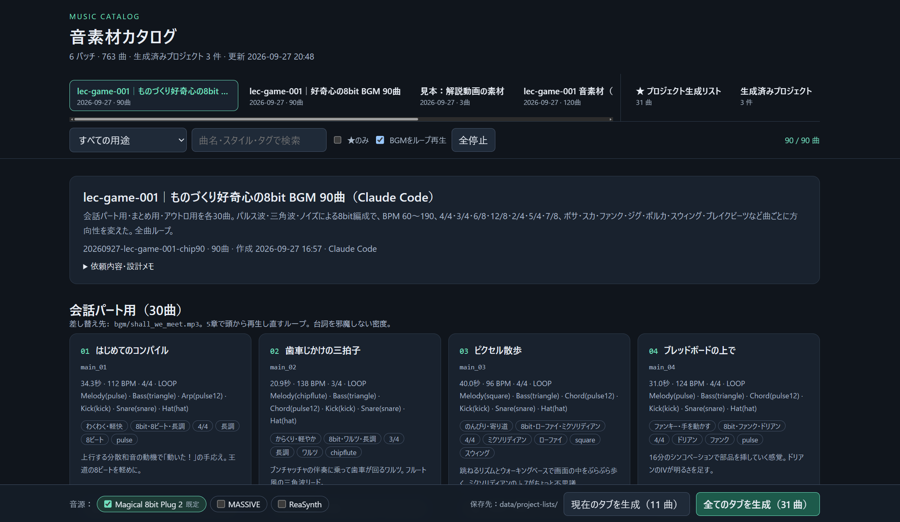
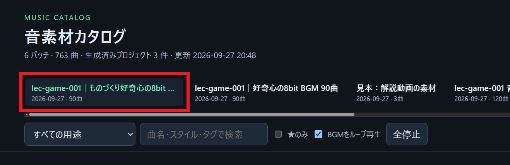
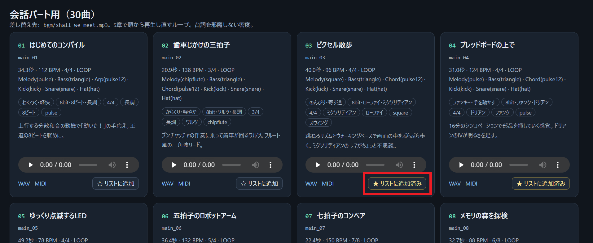
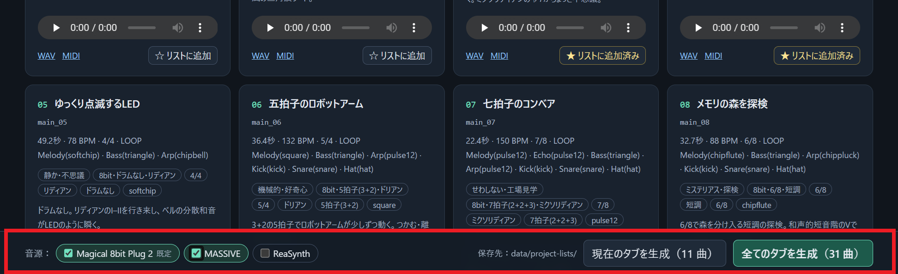
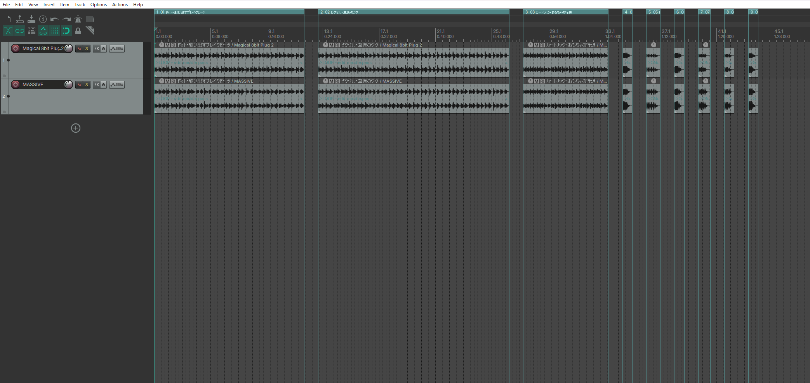
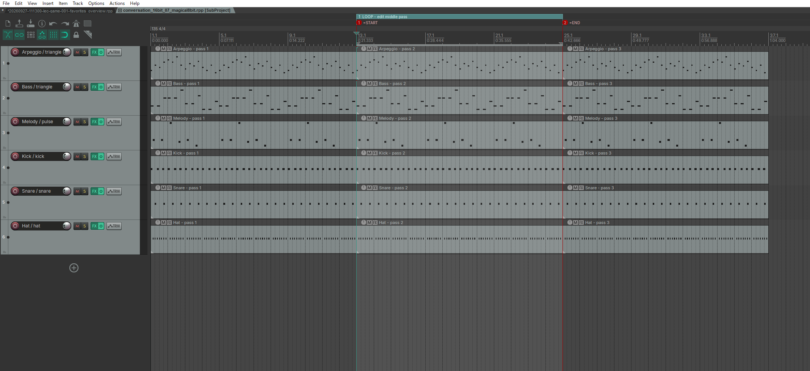

# agents-music-workbench

AIエージェント（**Codex** / **Claude Code**）に **BGM や効果音を作曲させた曲をブラウザで聴き比べ**、**選んだ曲を音色設定済みの REAPER プロジェクト**にするためのツール一式です。曲のプロトタイプ作成や、アイデア出しに活用できます。

```
 ① 作曲を依頼               ② 試聴して選ぶ                        ③ プロジェクト生成を依頼
 「会話用BGMを10曲」   →    data/library/index.html で ★     →    generate-projects.bat
  WAV・MIDIを書き出し        「全タブ／このタブの★を保存」             音源別 .rpp・試聴WAV・全曲まとめ
```

- 作曲はエージェントが **音符データ（Python）** として書くため、パート別の MIDI をそのまま REAPER で編集できます。
- 作曲スキルは同梱していないため、 [music-composition-skills](https://github.com/jtydhr88/music-composition-skills)（ARR-SPEC ワークフロー）等の利用を想定しています。Agentsのスキルとして追加した上でご使用ください。
- 試聴カタログは作曲した回（バッチ）ごとにタブで切り替わり、書き出すたびに自動で更新されます。
- REAPER 版は標準の ReaSynth で作ります（追加の音源は不要）。Magical 8bit Plug 2 や MASSIVE 用の設定も同梱しています。



## 動作環境

| ソフトウェア                     | 用途                                       | 備考                                               |
| -------------------------------- | ------------------------------------------ | -------------------------------------------------- |
| Python 3.10 以上 ＋ numpy        | 作曲データの書き出し・カタログ・REAPER連携 | `pip install -r requirements.txt`                  |
| Codex または Claude Code         | 作曲・プロジェクト生成を頼む相手           |                                                    |
| Chrome / Edge などのブラウザ     | 試聴カタログ                               | Chrome / Edge ならリストを直接フォルダへ保存できる |
| [REAPER](https://www.reaper.fm/) | プロジェクト生成                           | 7.x で確認。既定の音源 ReaSynth は REAPER に付属   |

任意の音源は、入れておくとカタログやコマンドで選べるようになります。<br>
動作確認は Windows 11 ＋ REAPER 7.80 で行っています。macOS / Linux は未確認です。

## セットアップ

```bash
git clone https://github.com/<you>/agents-music-workbench.git
cd agents-music-workbench
pip install -r requirements.txt
python python/cli.py doctor      # Python・REAPER・音源の確認
```

`doctor` で REAPER が見つからない場合や、既定の音源を変えたい場合（例：`["magical8bit", "massive"]`）は、`config.example.json` を `config.json` にコピーして編集します。

```json
{
  "reaper_path": "C:/Program Files/REAPER (x64)/reaper.exe",
  "profiles": ["reasynth"],
  "downloads_dir": "",
  "reaper_timeout_sec": 1800
}
```

### エージェントの準備

このリポジトリをエージェントの作業フォルダとして開くだけで、同梱のスキルが読み込まれます。

| エージェント | 読み込まれるファイル           |
| ------------ | ------------------------------ |
| Codex        | `AGENTS.md`、`.agents/skills/` |
| Claude Code  | `CLAUDE.md`、`.claude/skills/` |

スキルの本体は `.agents/skills/` の1か所だけです。Claude Code は `.claude/skills/` しか読まないため、そこには説明文と「本体を読む」案内だけを置いています（`python python/cli.py sync-skills` で本体から作り直せます）。

作曲の設計に music-composition-skills を使う場合は、別途導入してください（任意）。

```text
# Claude Code
/plugin marketplace add jtydhr88/music-composition-skills
/plugin install music-composition@music-composition-skills

# Codex
music-composition-skills の各スキルを ~/.agents/skills/ に配置（同リポジトリの README を参照）
```

## 使い方

### 1. 作曲を頼む

エージェントに用途や候補数を伝えます。

> 解説動画の会話パートで流すBGMを、レトロゲーム風で10曲作って。ループで使います。

> 章の見出しで鳴らす1秒くらいのSEを、明るいもの中心に8つ。

エージェントは `data/library/<日付-名前>/compose.py` に曲を書き、WAV と MIDI を書き出します。終わったら試聴カタログを開きます。

```
data/library/index.html   ← ブラウザで直接開く（サーバー不要）
```


### 2. 試聴して選ぶ

- 上部のタブで**作曲した回（バッチ）**を切り替えます。タブを開くと、依頼内容や設計メモも確認できます。



- 気に入った曲の **「☆ リストに追加」** を押します。★は全バッチ共通で、ブラウザに保存されます。
  - 「音符データなし」と表示される曲は音声だけの素材のため、REAPER プロジェクトにはできません（試聴・WAV保存のみ）。



- 画面下の保存ボタンを押します。
  - **「全タブの★を保存」**：すべてのバッチで★を付けた曲をまとめて保存します。
  - **「このタブの★を保存」**：いま開いているバッチのタブで★を付けた曲だけを保存します（他のタブの★は残ったまま、リストには入りません）。
  - 初回だけフォルダ選択が開くので、このリポジトリの **`data/project-lists`** フォルダを選びます。以降はワンクリックで `data/project-lists/latest.json` に保存されます。
  - 直接保存できないブラウザでは `project-list-latest.json` がダウンロードされます（ダウンロードフォルダも自動で探します）。



### 3. REAPER プロジェクトを生成する

この工程にはエージェントは不要です。<br>
リポジトリの **`generate-projects.bat`** をダブルクリックします（macOS / Linux は `./generate-projects.sh`）。最新のプロジェクト生成リストを読み込み、リストで選んだ音源で REAPER プロジェクトを作ります。

- 中身は `python python/cli.py project all` の実行だけです。引数もそのまま渡せます（例：`generate-projects.bat --profiles reasynth magical8bit`）。
- numpy の入った Python を自動で探します（`py -3` → `python` → `python3`）。見つからない場合は、環境変数 `MUSIC_PYTHON` に python の実行ファイルのパスを設定してください。
- エージェントに「最新のリストでREAPERプロジェクトを生成して」と頼んでも同じものが作れます。失敗したときの原因調べや、音源プロファイルの調整を任せたい場合に便利です。

REAPER が起動していれば、そのウィンドウに新しいタブを開いて作業し、終わると閉じます。起動していなければ自動で起動します。<br>
先頭の1曲で全音源の保存・読み込み・書き出しを確認してから、残りの曲へ進みます。

結果は `data/projects/<日時-名前>/` にまとまり、試聴カタログの **「生成済みプロジェクト」** タブで音源版を聴き比べられます。<br>
各プロジェクトの **「パスをコピー」** を押し、REAPER の「ファイル → プロジェクトを開く」のファイル名欄に貼り付けると開けます。

| ファイル                          | 内容                                                                                                                                                                                                                           |
| --------------------------------- | ------------------------------------------------------------------------------------------------------------------------------------------------------------------------------------------------------------------------------ |
| `<ジョブ>_overview.rpp`           | **全曲まとめ**。各曲がサブプロジェクトとして曲ごとのトラックに並ぶ（音源を複数選んだ場合は、曲のフォルダの中に音源ごとのトラックがあり、ソロで聴き比べられる）。アイテムをダブルクリックするとその曲の編集用プロジェクトが開く |
| `<曲>/<音源>/<曲>_<音源>.rpp`     | 音色設定済みの編集用プロジェクト（MIDI 埋め込み済み）                                                                                                                                                                          |
| `<曲>/score.mid`                  | 共通のパート別 MIDI（Type 1 / 960 PPQ）。音色は含まない                                                                                                                                                                        |
| `<曲>/<音源>/preview_matched.wav` | 音量を揃えた試聴用 WAV（48 kHz / 24-bit）                                                                                                                                                                                      |
| `<曲>/<音源>/sound_settings.tsv`  | 設定した音源パラメーターの記録                                                                                                                                                                                                 |
| `README.md` / `delivery.json`     | 成果物の一覧と検証結果                                                                                                                                                                                                         |

Overviewのプロジェクトは以下のようになっています。



各曲個別のプロジェクトは以下です。<br>
ループ曲は3周並べ、中央の1周が再生・書き出し範囲です（前後は余韻の確認用）。SE には 0.35 秒の余韻枠があります。



### エージェントなしで試す

見本の作曲データで、一連の流れを確認できます。

```bash
python python/cli.py new-batch demo --example    # 見本を data/library/<日付>-demo/ にコピー
python python/cli.py render <日付>-demo          # 書き出し＋カタログ更新
# data/library/index.html を開いて★ → 「全タブの★を保存」または「このタブの★を保存」
python python/cli.py project all                    # 既定の ReaSynth で生成
```

## コマンド

| コマンド                                                                          | 内容                                                                          |
| --------------------------------------------------------------------------------- | ----------------------------------------------------------------------------- |
| `python python/cli.py new-batch <名前> [--example]`                               | 作曲バッチの雛形を作る                                                        |
| `python python/cli.py render <バッチID> [--force]`                                | WAV・MIDI・一覧データを書き出し、カタログを更新                               |
| `python python/cli.py catalog`                                                    | カタログ（`data/library/index.html`）を作り直す                               |
| `python python/cli.py project-list [--file PATH]`                                 | 最新のプロジェクト生成リストを表示                                            |
| `python python/cli.py project all [--profiles ...] [--name 名前] [--stage pilot]` | リストから REAPER プロジェクトを生成                                          |
| `python python/cli.py project build [<ジョブID>] [--force]`                       | 生成の再開・続行（制作済みの曲は飛ばす）                                      |
| `python python/cli.py doctor`                                                     | 環境確認                                                                      |
| `python python/cli.py sync-skills`                                                | `.agents/skills`（本体）から Claude Code 用の案内 `.claude/skills` を作り直す |
| `python -m unittest discover -s tests`                                            | テスト                                                                        |

## 音源プロファイル

REAPER 版の音作りは `python/reaper/lua/profiles/` の音源プロファイルで決まります。パートの役割（メロディー・ベース・和音・分散和音・打楽器）ごとに音色を設定します。

| 名前          | 音源                       | 備考                                                             |
| ------------- | -------------------------- | ---------------------------------------------------------------- |
| `reasynth`    | ReaSynth（REAPER標準）     | **既定**。追加の音源なしで動く。ノイズ源がないため打楽器は近似   |
| `magical8bit` | Magical 8bit Plug 2        | 任意。パルス・三角波・ノイズによる8bit風の音                     |
| `massive`     | Native Instruments MASSIVE | 任意。役割ごとにウェーブテーブル・フィルター・エンベロープを設定 |

使う音源は次の順で決まります。複数選ぶと音源ごとにプロジェクトが作られ、聴き比べられます。

1. コマンドの `--profiles`（例：`project all --profiles reasynth magical8bit`）
2. 試聴カタログで保存するときに選んだ音源（画面下の「音源」）
3. `config.json` の `profiles`
4. 既定（`reasynth`）

### 音色の決まり方

REAPER 版は、元の試聴 WAV の音色を解析して再現するものではありません。**音符は正確に引き継ぎ、音色は音源ごとに作り直します。**

| 引き継ぐもの                                                                         | 引き継がないもの                                         |
| ------------------------------------------------------------------------------------ | -------------------------------------------------------- |
| 音の高さ・タイミング・長さ・強さ、パン、滑音、パートごとの音量バランス、テンポ・拍子 | 試聴用シンセの音色そのもの（倍音の構成、減衰の速さなど） |

音色は次の流れで決まります。

1. **判別の材料**：作曲データ（`events.json`）の各パートの **役割** と **音色名** を使います。
   - 役割：`lead`（メロディー）・`bass`・`pad`（和音）・`arp`（分散和音）・`drum`。作曲時に指定がなければパート名から推定します（`Kick` `Hat` → drum、`Bass` → bass など）。
   - 音色名：`pulse` `triangle` `bell` `hat` など、作曲時に指定した名前です。
2. **値の決定**：音源プロファイルに書かれたルールで、役割と音色名からパラメーター値を決めます。例：Magical 8bit では、音色名 `pulse` なら波形 Pulse/Square と Duty 25%、役割 `drum` で音色名 `hat` なら波形 Noise と短い Decay。
3. **VST への設定**：REAPER のスクリプト機能から、プラグインが公開しているパラメーターを名前で探して設定します。「Triangle」や「25%」のような表示どおりの値になるよう、REAPER 上で値を確かめながら合わせます。
4. **確認と記録**：プロジェクトを保存して開き直し、設定した値が残っているかを照合します。実際に設定した値は各プロジェクトの `sound_settings.tsv` に記録されます。

プラグインが外部に公開していない設定（例：MASSIVE のピッチベンド幅）は変更できません。音色の傾向を変えたいときは、音源プロファイルのルールを編集してください。

新しい音源を追加するには、プロファイルを1ファイル書きます。書き方は [.agents/skills/create-reaper-project/references/profiles.md](.agents/skills/create-reaper-project/references/profiles.md) を参照してください。パラメーター名や選択肢は、REAPER 上で実際の値を確認してから書いてください。

## フォルダ構成

```
generate-projects.bat     REAPER プロジェクトの生成（Windows。ダブルクリックで実行）
generate-projects.sh      同（macOS / Linux）
AGENTS.md / CLAUDE.md     エージェント向けの入口
.agents/skills/           スキルの本体（compose-music / create-reaper-project）
.claude/skills/           Claude Code 用の案内（本体を読ませるだけ）
python/
  cli.py                  入口（実行するのはこれだけ）
  settings.py             リポジトリのルートと各フォルダの場所、config.json の読み込み
  music/                  音符データの形式（Cue / Note / Scale）・試聴用シンセ・MIDI・バッチの書き出し
  catalog/                試聴カタログ（HTML）とプロジェクト生成リスト
  reaper/                 REAPER連携（lua/ は REAPER 内で動くスクリプト、lua/profiles/ は音源プロファイル）
  tools/                  環境確認・スキルの同期
examples/demo_batch/      作曲データの見本
tests/
data/                     作業データ（中身は Git の管理対象外）
  library/                作曲バッチと試聴カタログ（index.html）
  project-lists/          プロジェクト生成リスト（カタログから保存）
  projects/               REAPER プロジェクト
```

コード・設定と、自分の作業データ（`data/`）を分けています。作業データは `data/` フォルダにまとまっているので、バックアップもフォルダごとで済みます。

## よくある質問・制限

- **試聴WAVと REAPER 版で音が違う**：試聴 WAV は内蔵の簡易シンセによる近似です。REAPER 版は同じ音符を各音源で鳴らし直したアレンジです。
- **生成が止まった／タイムアウトした**：REAPER にダイアログ（ライセンス認証、評価版の案内、保存確認など）が出ていないか確認してください。閉じてから `project build <ジョブID>` で再開できます。ログは `data/projects/<ジョブ>/logs/` にあります。
- **プラグインを読み込めない**：REAPER の「オプション → 設定 → プラグイン → VST」で再スキャンし、`doctor` で登録を確認してください。
- **MASSIVE で滑音（グライド）の幅が違う**：MASSIVE はピッチベンド幅をホストから設定できません。音源側で合わせてください（`delivery.json` の warnings に記録されます）。
- **品質の保証**：自動検査（無音・クリップ・ループの継ぎ目・MIDIの一致・プロジェクトの再読み込み）は行いますが、音楽的な品質や既存曲との類似がないことは保証しません。必ず耳で確認してください。
- 生成した曲の利用にあたっては、ご自身の責任で確認してください。
